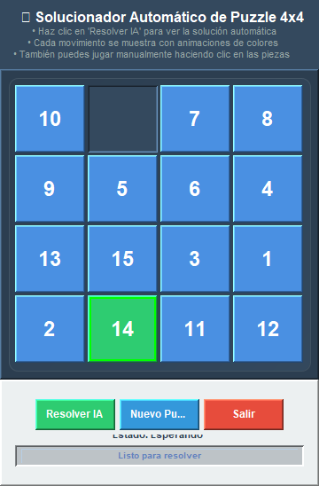
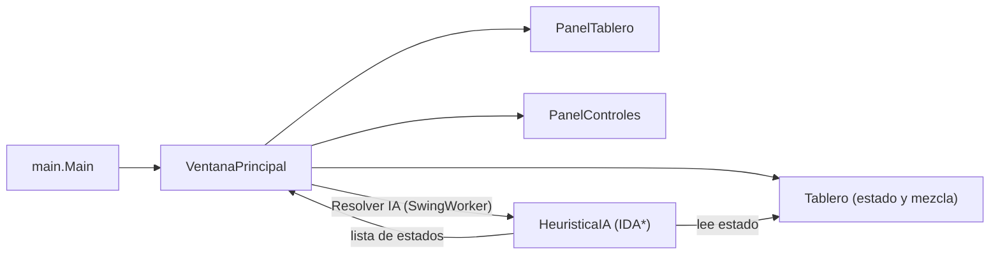

<div align="center">
  
  <h1>PuzzleMaestro</h1>
  <p><b>Puzzle deslizante 4x4 en Java Swing que se resuelve solo con IDA* (Manhattan + conflicto lineal).</b></p>
  
  
  
  
  
  
  <p>
    <a href="#-inicio-rápido">Inicio rápido</a> ·
    <a href="#-características">Características</a> ·
    <a href="#-arquitectura">Arquitectura</a> ·
    <a href="#-pruebas">Pruebas</a> ·
    <a href="#-lo-que-todavía-no-existe">Limitaciones</a>
  </p>
</div>

PuzzleMaestro es un 15-puzzle (tablero deslizante 4x4) de escritorio. Puedes jugarlo con el mouse o
pulsar **Resolver IA** para que un solucionador IDA* calcule y anime la solución paso a paso. Es un
ejemplo didáctico de búsqueda heurística; **no** es un solucionador con tablas de patrones ni hay
puntuaciones, niveles o modo multijugador.

## 🎬 Vista rápida

<div align="center">
  
</div>

Captura real de la ventana al iniciar (la casilla verde es un efecto de resaltado de la interfaz). En la
captura, el icono del título no se dibujó por falta de glifo en la fuente del entorno.

## ✨ Características

| Característica | Detalle |
|---|---|
| Tablero siempre solucionable | Cada partida se genera con entre 100 y 299 movimientos válidos aleatorios desde el estado resuelto. |
| Resolución con IDA* | Heurística: distancia de Manhattan + conflicto lineal (admisible), por lo que la solución hallada es de longitud óptima cuando la búsqueda termina. |
| Verificación de solucionabilidad | Comprueba la paridad de inversiones antes de buscar. |
| Juego manual | Clic en una pieza adyacente al hueco para moverla. |
| Animación de la solución | Un movimiento por segundo, con barra de progreso y estado. |
| Interfaz fluida | La búsqueda corre en un `SwingWorker` con un diálogo de progreso indeterminado. |
| Límites de seguridad | Profundidad máxima 80 (el "número de Dios" del 15-puzzle) y un tope de 30 s de búsqueda. |

## 🏗️ Arquitectura



<details>
<summary>Estructura de carpetas</summary>

```text
src/logica/        Tablero.java, HeuristicaIA.java   (sin dependencias de UI)
src/presentacion/  VentanaPrincipal, PanelTablero, PanelControles
src/main/Main.java punto de entrada (look and feel Nimbus si está disponible)
test/logica/       TableroTest, HeuristicaIATest     (JUnit 5)
pom.xml            sourceDirectory=src, testSourceDirectory=test (no sigue la convención de Maven)
run.bat            compila con javac y ejecuta en Windows
```

</details>

## 🚀 Inicio rápido

| Requisito | Versión |
|---|---|
| JDK | 17 o superior (`maven.compiler.release` = 17) |
| Maven | Opcional (JUnit 5.10.2 solo para pruebas) |

Con Maven:

```bash
git clone https://github.com/Luiss2080/PuzzleMaestro.git
cd PuzzleMaestro
mvn package
java -jar target/puzzlemaestro-1.0.0.jar
```

Sin Maven (en Windows también sirve `run.bat`):

```bash
javac -d bin src/logica/*.java src/main/*.java src/presentacion/*.java
java -cp bin main.Main
```

La ventana abre con un tablero mezclado: juega con el mouse, pulsa **Resolver IA** o **Nuevo Puzzle**.
Verificado: compilación con `javac` y ejecución de la ventana con JDK 25; las pruebas con Maven.

## 🧪 Pruebas

```bash
mvn test
```

**101 pruebas** JUnit 5 (57 en `HeuristicaIATest`, 44 en `TableroTest`); todas pasaron en la última
ejecución local. Cubren la distancia de Manhattan, la solucionabilidad, tableros mezclados por la app y
el solucionador de extremo a extremo (verifica que el estado final quede resuelto). No hay pruebas de
interfaz. El CI (`ci.yml`) corre `mvn -B test` y el empaquetado con JDK 17.

## 🚧 Lo que todavía no existe

- La búsqueda IDA* con estas heurísticas es exponencial: en tableros difíciles puede tardar mucho y se corta a los 30 s (entonces la app avisa de que no encontró solución).
- Sin pruebas automatizadas de la interfaz Swing; los movimientos manuales no se prueban.
- Sin puntuación, temporizador de partida, otros tamaños de tablero ni guardado de partidas.
- `DEMO.md` contiene ilustraciones ASCII de ejemplo que no son capturas reales y no coinciden del todo con la interfaz actual (botones, algoritmo indicado): no las tomes como referencia.

## 📄 Licencia

MIT: ver [LICENSE](LICENSE).

<div align="center">
  <sub>Hecho por Luiss2080 · Búsqueda heurística con Java Swing</sub>
</div>
